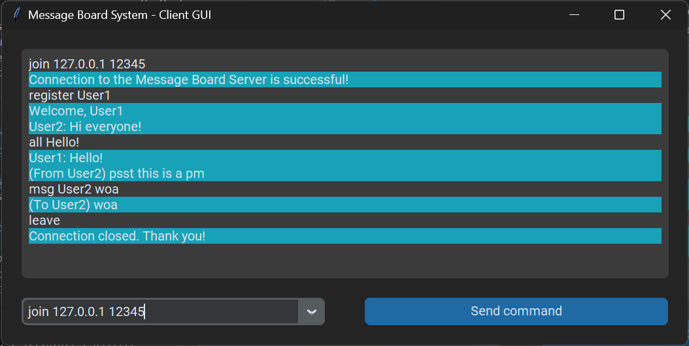

# Message Board System

This is a simple client-server messaging system made for a Network class project. The program allows multiple clients to connect to a server and send messages to each other. The system uses UDP communication and socket programming were implemented for the server to handle multiple clients simultaneously.

## Usage

For this program, we imported `customtkinter`, `socket`, `sys`, `json`, and `threading`

1. Install customtkinter by running `pip3 install customtkinter`
2. Start the server by running `python server.py` in the command line.
3. Start the client by running `python clientgui.py` in the command line.
5. You can type the following commands (with no slashes or backslashes at the front):
    - `join <IP> <port>`
    - `leave`
    - `register <handle>`
    - `all <message>`
    - `msg <handle> <message>`
    - `?`

The correct IP address is `127.0.0.1` and the correct port is `12345`. **Please see the [Guide.pdf](./Guide.pdf)  file for a detailed guide.**

## Members:
- Martinez, Kyle
- Ong, Ben 
- Palpallatoc, Aaron

## License

This project is licensed under the MIT License - see the LICENSE file for details.